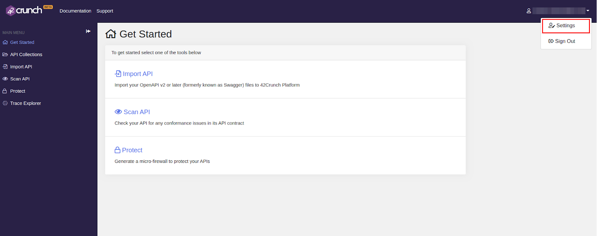

## Securing APIs by auditing API Definitions

Include brief introduction here

## How to enable the audit feature

### Retrieve API Token and Collection ID

1.  Navigate to the [42crunch platform](https://platform.42crunch.com) and register or sign in.

2.  Create a new API Token from the **Settings** Menu as shown below.

    

3.  Click on the **API Tokens** tab and select **Create New Token**

    

4.  A dialog box will be shown where you need to enter the name of the Token and select appropriate access rights. For the audit feature to work, only the **API Contract Security Audit** permission is required.

    

5.  Clicking on the **Generate Token** will lead to another dialog box showing the generated API Token.

    !!! note 
        The generated API Token will only be shown once, so make sure to copy it and save it in a safe place for reference.

    

6.  Now create a new Collection by clicking any one of the highlighted areas below.

    !!! note
        A Collection in this context is a folder hosted on 42Crunch for all the APIs that are audited

    

7.  Copy the Collection ID from the URL of the browser as highlighted below and save it in a safe place for reference, just like the API Token.

    

### Configure WSO2 API-M with the retrieved properties

The retrieved API Token and the Collection ID properties have to be placed inside the configuration files inside WSO2 API-M. There are two ways to do so.

#### Enabling the feature server-wide 

If these properties are to be accessible to all tenants, navigate to the `<API-M_HOME>/repository/conf/deployment.toml` file and make the following changes:

``` bash tab="Format"
    [security_audit]
    api_token="{api-token}"
    collection_id="{collection-id}"
    global=true
```

``` bash tab="Example"
    [security_audit]
    api_token="xxxxxxxx-xxxx-xxxx-xxxx-xxxxxxxxxxxx"
    collection_id="xxxxxxxx-xxxx-xxxx-xxxx-xxxxxxxxxxxx"
    global=true
```

!!! tip
    If you want to prevent the properties being used by any other tenants other than the super tenant, then set the **global** property to **false**.

#### Enabling the feature tenant-wise

If the properties are to be available to a specific tenant only, then do the following:

1.  Sign in to the WSO2 API Management Console with your tenant credentials at `https://<server-host>:9443/carbon`.

    !!! tip
        For more information on creating a tenant, see [Managing Tenants](https://docs.wso2.com/display/ADMIN44x/Working+with+Multiple+Tenants).

2.  Click the **Main** tab, and then **Browse**, which is under **Resources** as shown below.

    

3.  Enter / `_system/config/apimgt/applicationdata/tenant-conf.json` as the location and click **Go** to access the `tenant-conf.json` file that is in the WSO2 Registry.

4.  Click **Edit as text** to be able to edit the JSON file.
